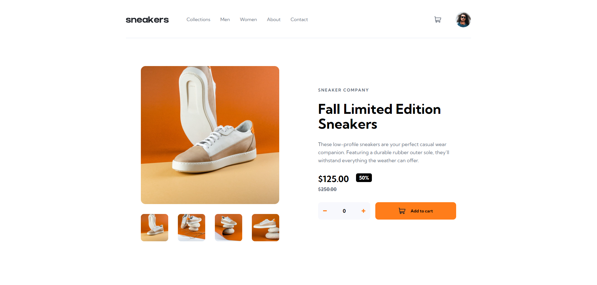

# Frontend Mentor - E-commerce product page solution

This is a solution to the [E-commerce product page challenge on Frontend Mentor](https://www.frontendmentor.io/challenges/ecommerce-product-page-UPsZ9MJp6). Frontend Mentor challenges help you improve your coding skills by building realistic projects.

## Table of contents

- [Overview](#overview)
  - [The challenge](#the-challenge)
  - [Screenshot](#screenshot)
  - [Links](#links)
- [My process](#my-process)
  - [Built with](#built-with)
  - [What I learned](#what-i-learned)
- [Author](#author)

## Overview

### The challenge

Users should be able to:

- View the optimal layout for the site depending on their device's screen size
- See hover states for all interactive elements on the page
- Open a lightbox gallery by clicking on the large product image
- Switch the large product image by clicking on the small thumbnail images
- Add items to the cart
- View the cart and remove items from it

### Screenshot

### Links

- [Solution URL](https://github.com/Antonvasilache/e-commerce-product-page-main)
- [Live Site URL](https://ecommerce-product-page-main-av.netlify.app/)

## My process

1. Built the static page for desktop.
2. Created the active states.
3. Added functionality for shopping cart and photo display with JS.
4. Created the lightbox functionality.
5. Added responsiveness for smaller screens.
6. Adapted the photo navigation functionality for smaller screens.
7. Created the mobile menu and overlay.
8. Added responsiveness for the active states.

### Built with

- Semantic HTML5 markup
- CSS custom properties
- Flexbox
- CSS Grid

### What I learned

- How to create the UI functionality for a shopping cart popover.
- How to create a lightbox.
- How to refactor JS functionality to be used in different UI contexts.
- How to make active states responsive.

## Author

- Website - [Antonvasilache.com](https://www.antonvasilache.com)
- Frontend Mentor - [@Antonvasilache](https://www.frontendmentor.io/profile/Antonvasilache)
